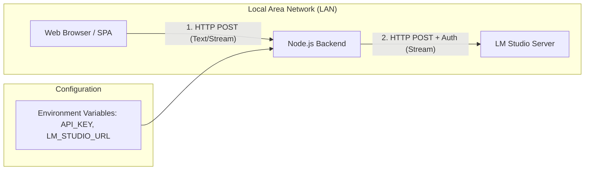

# Project Plan: LM Studio Chat SPA

## 1. High-Level Architecture

The application follows a **Proxy-Client architecture** to bridge the gap between the web browser and the local LLM server, enabling streaming capabilities and secure API key handling.

### Data Flow
1.  **User Input:** User types a message in the SPA and hits send.
2.  **Request Proxying:** The SPA sends an HTTP request to the Node.js backend.
3.  **Authenticated Upstream Request:** The Node.js backend attaches the `Authorization: Bearer <API_KEY>` header and forwards the request to the LM Studio endpoint.
4.  **Stream Forwarding:** As LM Studio generates tokens, the Node.js backend pipes the incoming stream directly back to the SPA using **Server-Sent Events (SSE)** or a standard **Fetch ReadableStream**.
5.  **UI Update:** The SPA parses the incoming chunks and updates the conversation history window in real-time.

---

## 2. Technology Stack Recommendations

### Backend: Node.js
I recommend **Fastify** for this specific use case.

| Framework | Pros | Cons |
| :--- | :--- | :--- |
| Fastify | much faster than Express; excellent support for asynchronous streams (crucial for LLM responses). | Slightly different syntax/plugin-based architecture compared to the traditional Express pattern. |
| Express | Industry standard, massive middleware ecosystem, very easy to find documentation. | Slower overhead; handling high-frequency streaming chunks is less efficient than Fastify. |

### Frontend: SPA Framework
I recommend **Svelte** or **React**.

| Framework | Pros | Cons |
| :--- | :--- | :--- |
| Svelte | Minimal boilerplate, extremely lightweight, and excellent "reactive" primitives that make updating a chat window with incoming tokens very simple. | Smaller ecosystem/community compared to React. |
| React | Mature ecosystem, powerful state management (Hooks), perfect for complex UI components. | Higher complexity due to the Virtual DOM and more boilerplate code for managing stream-based state updates. |

### Communication Protocol
*   **Backend $\to$ LM Studio:** Standard HTTP `fetch` with `stream: true`.
*   **SPA $\to$ Backend:** **Server-Sent Events (SSE)** or **Fetch API with ReadableStream**. SSE is highly reliable for one-way text streaming from server to client.

---

## 3. Implementation Roadmap

### Phase 1: Backend Foundation
*   **Environment Configuration:** Setup `.env` for `LM_STUDIO_URL` and `LM_STUDIO_API_KEY`.
*   **Server Setup:** Initialize Fastify server with CORS enabled (to allow LAN access).
*   **Proxy Implementation:** Create a POST endpoint `/api/chat` that uses `undici` or `node-fetch` to forward requests to LM Studio. 
*   **Stream Piping:** Implement the logic to capture the `ReadableStream` from the upstream response and pipe it into the downstream response object.

### Phase 2: Frontend Development

> **Status**: Step 1 (UI skeleton) is **COMPLETE** on branch `frontend/ui-scaffolding`.
> It was built against the approved design system in `agents/documentation/design.md`
> (visual reference: `design/mockup.html`) — app name "Local", warm charcoal/paper
> palette with a single ember accent, dark default with light theme via
> `prefers-color-scheme`, and `prefers-reduced-motion` honored. The Svelte 5 shell
> (`App.svelte`) wires a topbar (`Header` with model-selector popover and status),
> a scrollable message region (`MessageList` with the design empty state and
> suggested-prompt chips), and the composer footer (`ChatInput` with hints and a
> disabled-when-empty send button). Message state, streaming, and submission are
> intentionally not implemented yet (Steps 2–4). Backend integration is provided
> by the `feature/step-1-environment-setup` backend worktree.

*   **UI Skeleton:** Create the chat window container, message bubbles (User vs. Assistant), and a sticky bottom input area. *(Step 1 complete — shell and empty state per the design system; bubbles arrive with Step 2.)*
*   **Streaming Logic:** Implement a service to call the backend API using `fetch`. Use the `ReadableStream` interface to iterate over chunks as they arrive.
*   **State Management:** Implement reactive state to append new tokens to the "current" message in the history without re-rendering the entire list.

### Phase 3: LAN Deployment & Testing
*   **Network Binding:** Configure the Node.js server to listen on `0.0.0.0` instead of `localhost`.
*   **Integration Test:** Verify that a request sent from a different device on the same WiFi/LAN correctly reaches the backend and receives the streamed response.
