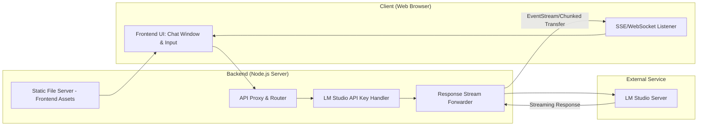

# Project Plan: LM Studio Chat SPA

## Overview
Development of a Single Page Application (SPA) designed to serve as a lightweight web interface for an LLM running on LM Studio. The application will consist of a Node.js backend acting as a proxy and a modern frontend for user interaction.

## High-Level Architecture

## Development Plan

> **Implementation status:** Phase 1 is implemented step-by-step on reviewable branches merged to `master`.
> Step 1 (environment setup) is **done**: Fastify server bootstrap (`src/app.ts`, `src/server.ts`), validated config module (`src/config.ts`), `.env.example` (using `LM_STUDIO_URL`, `LM_STUDIO_API_KEY`, `HOST`, `PORT`, `CORS_ORIGIN`), CORS, a `/health` route, and a Vitest suite. The backends steps below are implemented on `feature/step-*` branches.

> **Status:** UI design is complete and captured in `agents/documentation/design.md` (styling spec) plus `design/mockup.html` (static mockup). The `frontend/` Svelte scaffold is placeholder styling awaiting implementation per the spec; live LM Studio streaming remains future work.

### Phase 1: Backend Foundation
- [x] **Environment Setup**: Initialize Node.js project and install core dependencies (proxy, server framework).
- [ ] **Static File Serving**: Implement the ability to serve pre-built frontend assets from a `public` directory.
- [ ] **LM Studio Integration**:
    * [ ] Implement request forwarding logic.
    * [ ] Configure API Key header injection for LM Studio authentication.
- [ ] **Streaming Implementation**:
    * [ ] Set up Server-Sent Events (SSE) or Chunked Transfer Encoding to relay chunks from the LM Studio response stream directly to the client.

### Phase 2: Frontend Development
**Status:** Step 1 (UI scaffolding) implemented on branch `frontend/ui-scaffolding` with unit tests. Steps 2-4 pending.

> **Implementation decisions (Phase 2 step 1):** The frontend is **Svelte 5** using **Vite**, in a standalone `frontend/` subproject with its own `package.json`, `bun.lock`, `tsconfig.json`, and Vitest+jsdom test suite (`@testing-library/svelte`). The layout is a flex column: a scrollable message region (`MessageList`) and a bottom-sticky input bar (`ChatInput`) inside a viewport-height shell (`App`). Message submission, state, and streaming are future steps.
1.  **UI Scaffolding**: Create a basic layout with a scrollable message area and a fixed bottom input bar.
2.  **State Management**: Implement logic to manage the conversation history array (user messages vs. assistant messages).
3.  **Streaming Client Logic**: 
    *   Use `fetch` API with `ReadableStream` or an `EventSource` listener to process incoming text chunks.
      * Ensure UI updates incrementally as tokens arrive.
4.  **Input Handling**: Implement message submission, loading states (typing indicators), and auto-scrolling behavior.

### Phase 3: Integration & Testing
1.  **End-to-End Testing**: Verify that a prompt sent from the browser correctly triggers an LM Studio inference and streams back to the UI.
2.  **Error Handling**: Implement error boundaries for backend connectivity issues (e.g., LM Studio server down).

## Framework Suggestions

### Backend (Node.js)

| Framework | Pros | Cons |
| :--- | :--- | :--- |
| **Express.js** | Industry standard, massive ecosystem of middleware, extremely easy to learn and implement. | Slower performance compared to newer alternatives; requires more manual configuration for modern streaming patterns. |
| **Fastify** | Extremely high performance; built-in support for JSON schema validation and excellent handling of streams/payloads. | Slightly steeper learning curve than Express; smaller ecosystem of specialized plugins. |

**Recommendation**: **Fastify** is preferred here due to its superior performance with streaming data and modern architecture, which aligns well with the "proxying" nature of this task.

### Frontend (SPA)

| Framework | Pros | Cons |
| :--- | :--- | :--- |
| **React** | Largest ecosystem; powerful hooks (`useReducer`, `useEffect`) for managing complex streaming state. | Higher boilerplate/complexity; requires more architectural decisions (e.g., choosing a state management lib). |
| **Vue.js** | Very approachable; excellent reactivity system that makes updating the UI with incoming chunks intuitive. | Slightly smaller ecosystem than React for highly specialized streaming components. |
| **Svelte** | Minimal boilerplate; compiles away the framework, resulting in extremely lightweight and fast bundles (perfect for LAN). | Smallest ecosystem of the three; fewer pre-made component libraries. |

**Recommendation**: **Svelte** is recommended. Since this is a simple utility app for LAN use, Svelte's minimal overhead, high performance, and simplicity in managing reactive text streams make it the most efficient choice.
